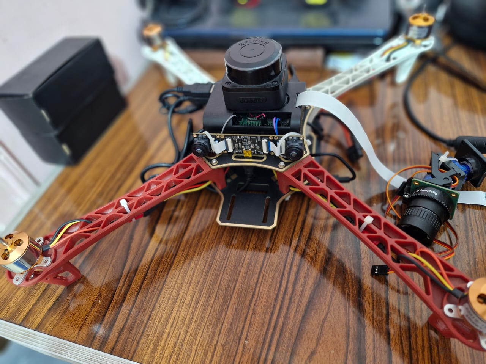
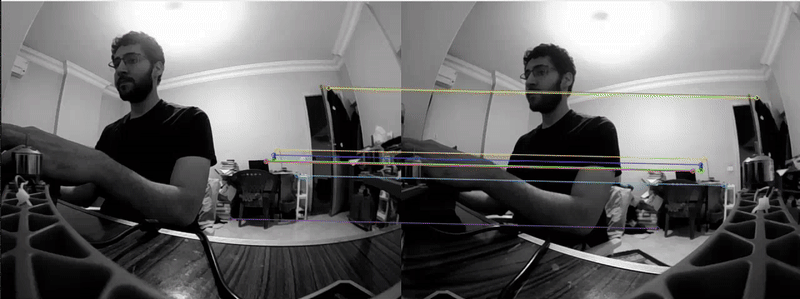
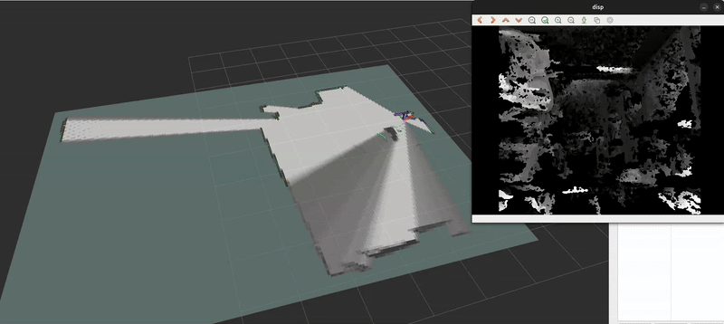

# How it works
The quadcopter will utilize computer vision and slam for navigation and mapping. Since the pi 4B would not be able to run cv algorithms in real-time, it will publish the image as messages that can be subscribed from by the local machine that is powerful enough to run cv. Also, the mapping will be computed on the local machine, meaning that the pi will publish the readings it gathers, which will then be computed in the local machine

# Components:
- F450 quadcopter frame
- Flight computer (RaspberryPi 4B 4Gb)
- Flight computer (Speedybee F405 V3 stack)
- Binocular camera module (for depth and as the front camera)
- Slamtec RPLidar C1 (for mapping)
- 4 BLDC (1000 kv)
- 10x47 propellers
- 3A power bank (powersupply for the flight computer)
- 2200 mah 3S lipo battery (for the flight controller and the motors)
- 2 servo motors (for camera rotation) (optional)
- Mobile Wifi module (optional)

Some ros2 nodes will run on the flight computer (in our case the raspberry pi), and the remaining will run on the local machine (the computationally intensive nodes)

# For the local machine

# For the flight computer
The feature matching will be used for V-SLAM along with disparity maps for depth computation

The flight computer will be responsible for publishing the lidar and the stereo camera data. These will be processed by the local machine for visualization, navigation commands, and SLAM. I have used CartographerSLAM for LiDAR SLAM along with disparity map that will be used for depth computation. The disparity map is noisy and contains a lot of black regions (where the algorithm could not detect features). Another disparity algorithm will be implemented but this might work for now

# To do list:
- [X] Test the cameras and the lidar module 
- [X] Create/Import the components' urdf
- [ ] Visualize the model in gazebo
- [X] Implement SLAM
- [X] Test indoor mapping
- [ ] Create the control directory
- [ ] Test indoor navigation
- [ ] ROS2 with ardupilot

# Issues:
- Publisher/Subscriber slows down when a node subscribes to topics with img_msgs (fixed)
- Imencode not found error when using compressed_img_msgs (fixed)
